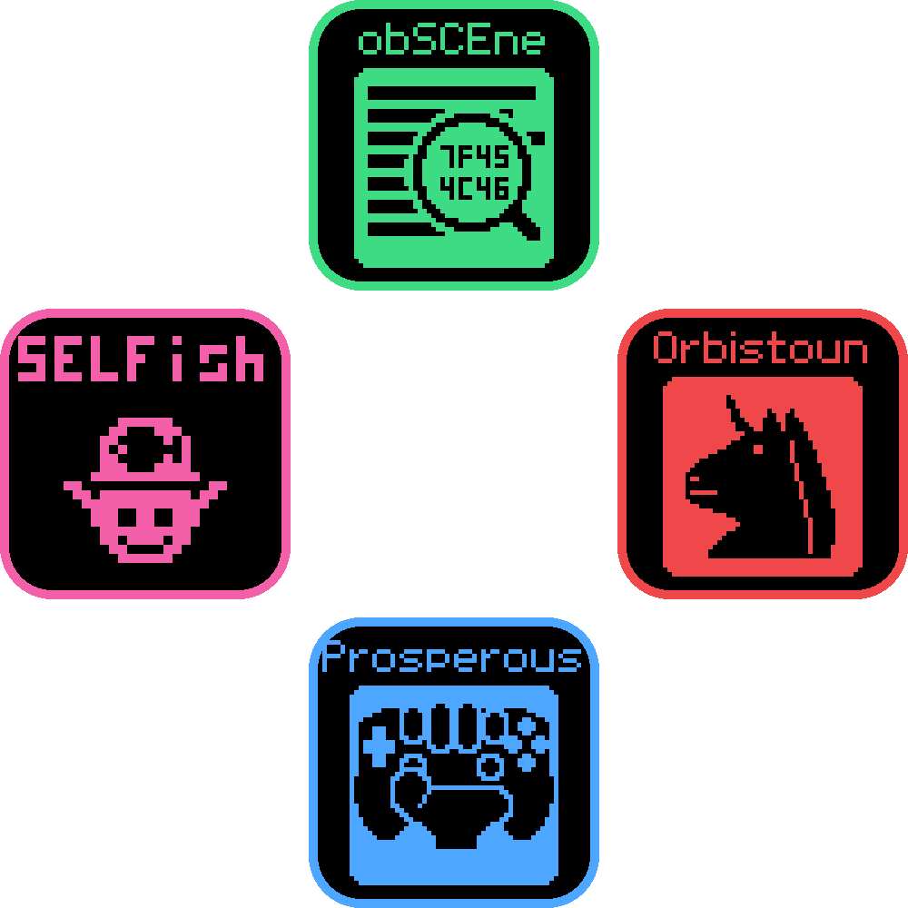

<p align="center">
  
</p>

# OOPS

**O**rbistoun, **o**bSCEne, **P**rosperous, **S**ELFish.

Four projects aimed at one platform: an emulator, a conformance probe, remote management,
and the file formats underneath them.

| | | |
|---|---|---|
| **[Orbistoun](https://github.com/project-oops/Orbistoun)** | the emulator | attempts to reimplement what a title runs on, so its code can run natively |
| **[obSCEne](https://github.com/project-oops/obSCEne)** | the probe | a guest that interrogates whatever runs it and reports what it found |
| **[Prosperous](https://github.com/project-oops/Prosperous)** | the instrument | remote management for anything that runs Orbis software |
| **[SELFish](https://github.com/project-oops/SELFish)** | the formats | read, write and build tools for the platform's own file formats |

Underneath them, **[oops-libs](https://github.com/project-oops/oops-libs)** - the build stamp,
logging, paths and the in-app documentation viewer. A fifth repository and **not** a fifth
project: OOPS is still the four above. Things go in it because they were already being written
twice, not because they might be shared.

**This is the development entry point.** Clone it and you have everything, arranged so it
builds - which matters because the four depend on each other and that is expected to
increase rather than decrease.

The separate repositories are how each project reaches the people who *use* it: releases,
binaries, issues, and a README aimed at someone who wants that one thing. A person who
wants to run a conformance probe against their emulator downloads it; a person changing
how the probe works clones this.

## What the collection is for

**Running Orbis software on an ordinary computer, from a codebase that can be published.**

The second half is the constraint that shapes everything. It is not difficult to make an
emulator work by copying what the hardware does; it is difficult to make one whose every
behaviour can be explained from a lawful source, and only that kind can be shared, packaged
or accepted from a contributor. So no firmware, no keys, no decrypted titles, no
disassembly - and where a fact came from is recorded beside the fact.

That constraint is why there are four projects instead of one.

## The oracle problem, which is the whole shape of it

An emulator of an undocumented platform can tell you *that* a guest died and almost never
*whether an answer was right*. A function returns a number; the guest carries on or it does
not; forty thousand frames later something is wrong. There is no specification to test
against, because the specification is the thing being reconstructed.

Each project exists to remove one unknown from that question:

```
                        SELFish
              what is actually in the file
                            |
        +-------------------+-------------------+
        |                   |                   |
   Orbistoun            obSCEne            Prosperous
   what should       what does the       what does the
   happen here       platform do         real one do
```

- **obSCEne removes the guest.** It is a program *we* wrote, so what it asks for is known
  exactly and what came back can be judged. A commercial title can only ever tell you it
  stopped.
- **Prosperous removes the emulator.** The same probe on real hardware answers what the
  platform does, rather than what some reimplementation of it does.
- **SELFish removes the parser.** When two projects disagree about a file, one shared and
  cited reader is a better answer than two independent readings.

---

*Assembled from [the OOPS README](https://github.com/project-oops/OOPS/blob/main/README.md). Edit it there.*
